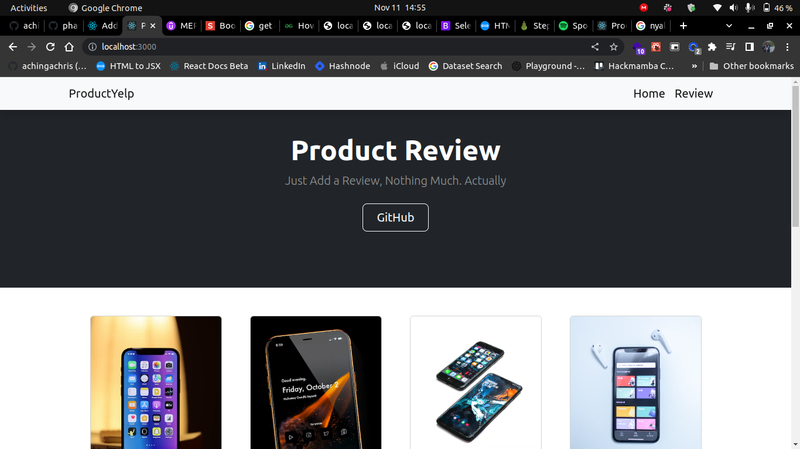

# Product Review

[Frontend](./frontend/)

[Backend](./backend/)



## Running The Project:

### Starting the Server

Switch to the backend directory and run the following commands:

```bash
bundle install

rake db:migrate

rake db:seed

rake server
```

Server runs on localhost:8000

### Starting the Client

Switch to the frontend directory and run the following commands:

```bash

npm install

npm start

```

Server runs on localhost:3000


## Backend Structure (API)

SINATRA (RUBY) - Used on the backend for Active Records-based API development.

### Models

- Products
- Users
- Reviewa

ActiveRecord will manage the database.

Sinatra API routes that take care of all CRUD operations for Active Record entities.
 
### API ROUTES: 

`http://localhost:8000/products`
```ruby
 get '/products' do
        product = Product.all
        product.to_json
    end
``` 
 
`http://localhost:8000/reviews`
```ruby
   get '/reviews' do
        reviews = Review.all
        reviews.to_json
    end
```
 
 
`http://localhost:8000/users`

```ruby
    get '/users' do
        user = User.all
        user.to_json
    end
``` 
 
 
### ROUTES Methods and Actions
 
#### GET

`/reviews`: returns all reviews

`/reviews/:id`: returns a specific review
 
`/products`: returns all products

`/products/:id`: returns a specific product

 
#### DELETE
`/reviews/:id`: deletes a specific review


## Task Assignment:

### Chris 
Deploy, Backend*, Frontend* => connect API to front

### Angela
Frontend: Setting up React, React Router

### Timothy
Backend: API Routes

### Jerry
Fronted: Implementing UI

### Mary
Backend: DB Connection & Migration
